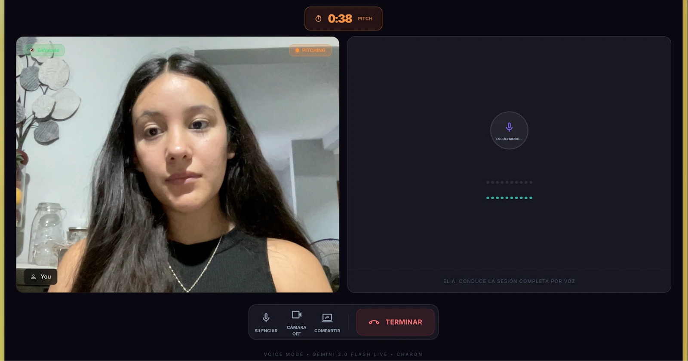
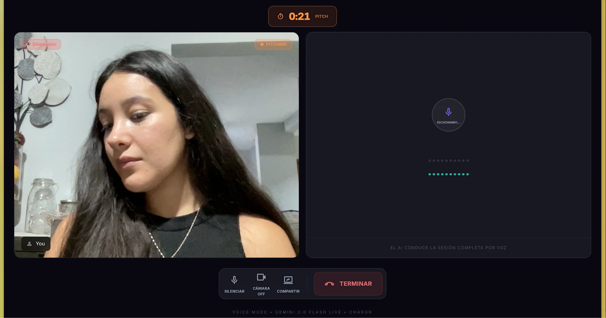
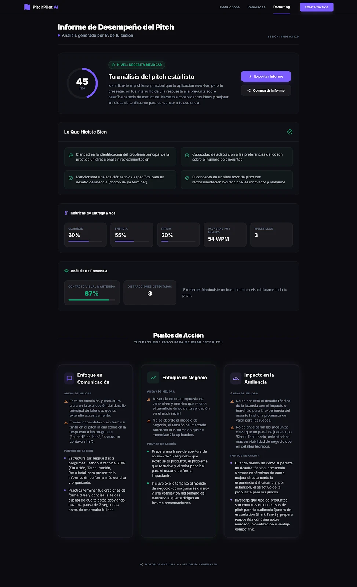
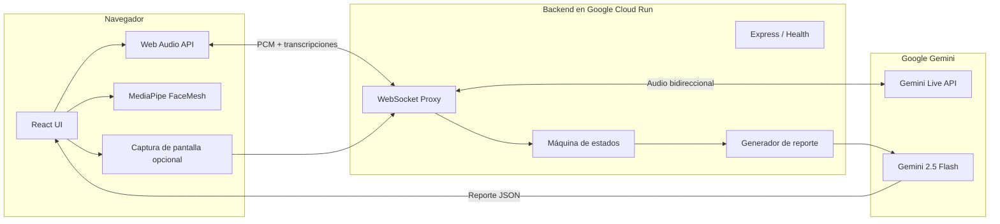
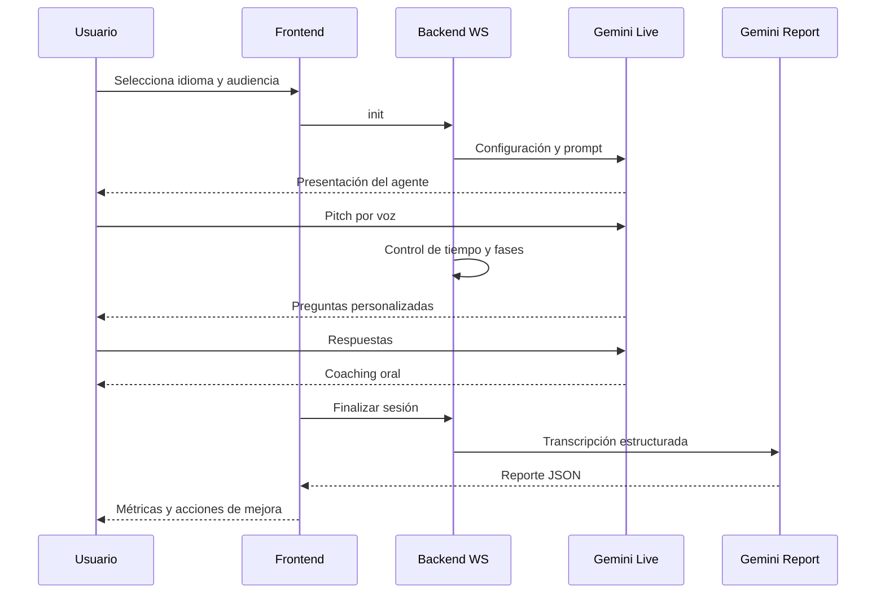

# PitchPilot AI — Practica tu pitch con una audiencia de IA

<p align="center">
  <strong>Simulador de pitches por voz con inteligencia artificial en tiempo real.</strong><br />
  Habla. Responde. Recibe retroalimentación. Mejora.
</p>

<p align="center">
  
  
  
  
  
  
  
</p>

<p align="center">
  <a href="https://mx.donatohernandez.dev">Portafolio</a>
</p>

---

## Sobre este repositorio

Este repositorio documenta **PitchPilot AI** como caso de estudio técnico y de producto. Su propósito es explicar el problema, la experiencia de usuario, la arquitectura de tiempo real y las decisiones de ingeniería detrás de la solución.

El código de producción se mantiene en un repositorio privado. Este repositorio no contiene credenciales, variables de entorno, transcripciones de usuarios ni información sensible.

## Resumen

PitchPilot AI permite practicar una presentación frente a una audiencia simulada por IA. El usuario configura el idioma, el tipo de audiencia y el contexto; después presenta su pitch, responde preguntas personalizadas y recibe coaching junto con un reporte accionable.

La experiencia completa sucede mediante voz bidireccional en tiempo real con **Gemini Live API**. El sistema coordina cada sesión como una secuencia de fases, transmite audio mediante WebSockets y genera al final un análisis escrito con puntuación, métricas, fortalezas y próximos pasos.

## El problema

Practicar una presentación sin interlocutor no reproduce la presión, las preguntas ni la incertidumbre de una sesión real. Al mismo tiempo, contratar un coach puede ser costoso o no estar disponible cuando la persona necesita prepararse.

Las principales fricciones identificadas fueron:

- La práctica individual no ofrece preguntas inesperadas ni objeciones reales.
- La retroalimentación suele llegar tarde o depender de otra persona.
- Cada audiencia evalúa aspectos distintos de un pitch.
- Los usuarios necesitan orientación concreta, no solamente una calificación.
- La ansiedad aumenta cuando no existe una forma accesible de ensayar varias veces.

## La solución

PitchPilot AI combina una simulación conversacional y un reporte posterior a la sesión:

1. **Onboarding:** el usuario elige idioma, audiencia, contexto y número de preguntas.
2. **Pitch:** dispone de 45 segundos para presentar su idea o desarrollo.
3. **Q&A:** la IA adopta el rol seleccionado y realiza preguntas personalizadas.
4. **Coaching:** el agente abandona el personaje y ofrece retroalimentación oral.
5. **Reporte:** se genera un análisis con métricas, fortalezas y acciones de mejora.

## El producto en funcionamiento

### Simulación en vivo

Durante la sesión, la aplicación transmite la voz del usuario y reproduce las respuestas de la IA. De forma opcional, también analiza localmente la atención visual para detectar contacto con la cámara y periodos de distracción.

<table>
  <tr>
    <td width="50%" align="center">
      
    </td>
    <td width="50%" align="center">
      
    </td>
  </tr>
  <tr>
    <td align="center"><strong>Contacto visual detectado</strong></td>
    <td align="center"><strong>Distracción detectada</strong></td>
  </tr>
</table>

### Reporte accionable

Al terminar, el sistema convierte la conversación en un reporte estructurado. No se limita a mostrar un puntaje: identifica qué funcionó, qué debe mejorar y qué acciones puede practicar el usuario antes de su siguiente presentación.

<p align="center">
  
</p>

## Funcionalidades principales

| Funcionalidad | Descripción |
|---|---|
| **Conversación por voz en tiempo real** | Audio bidireccional entre el navegador y Gemini Live mediante WebSockets. |
| **Audiencias configurables** | Simula inversionistas, jueces, profesores, clientes u otros perfiles. |
| **Sesiones bilingües** | Experiencia y prompts disponibles en español e inglés. |
| **Pitch cronometrado** | Controla una presentación de 45 segundos y continúa al Q&A de forma guiada. |
| **Preguntas dinámicas** | Genera preguntas a partir del contenido del pitch y del tipo de audiencia. |
| **Coaching conversacional** | Cambia de audiencia a coach y ofrece retroalimentación oral contextual. |
| **Reporte con IA** | Produce score, resumen, fortalezas, métricas y áreas de mejora. |
| **Análisis de voz** | Incluye estimaciones de claridad, energía, ritmo, palabras por minuto y muletillas. |
| **Análisis de presencia** | Detecta contacto visual y distracciones localmente con MediaPipe FaceMesh. |
| **Exportación a PDF** | Permite descargar el reporte generado al finalizar la sesión. |
| **Compartir pantalla** | Envía contexto visual opcional para enriquecer la simulación. |
| **Reconexión automática** | Recupera sesiones ante cierres programados de Gemini Live. |

## Mi rol

### Cofundador · Full-Stack Developer · Backend Engineer

Diseñé y desarrollé el sistema de extremo a extremo, con especial atención a la transmisión de voz, la orquestación de sesiones y la infraestructura en la nube.

### Backend y comunicación en tiempo real

- Construí el backend con Node.js, TypeScript, Express y `ws`.
- Diseñé un proxy WebSocket entre el navegador y Gemini Live API.
- Implementé streaming de audio bidireccional y transcripción de entrada y salida.
- Organicé la lógica de negocio como una máquina de estados por conexión.
- Añadí reconexión proactiva ante eventos `goAway` de Gemini.
- Conservé contexto reciente para reanudar conversaciones sin reiniciar la sesión.
- Implementé reintentos y fallbacks para la generación del reporte.

### Inteligencia artificial y diseño de conversación

- Integré Gemini Live para la conversación de voz y Gemini 2.5 Flash para el reporte.
- Diseñé prompts bilingües para los modos audiencia y coach.
- Definí eventos de sistema que coordinan pitch, preguntas, coaching y cierre.
- Construí el contrato JSON del reporte y su normalización para el frontend.
- Incorporé instrucciones para adaptar las preguntas al contexto y audiencia elegidos.
- Evité exponer la clave de Gemini en el navegador mediante el proxy de servidor.

### Frontend y procesamiento multimedia

- Implementé la experiencia en React con captura y reproducción de audio mediante Web Audio API.
- Construí temporizadores, controles de sesión, estados de conexión y visualización de fases.
- Integré cámara, pantalla compartida y MediaPipe FaceMesh.
- Desarrollé el reporte visual y su exportación a PDF con `html2canvas` y `jsPDF`.
- Implementé la interfaz bilingüe y los estados de error, reconexión y generación.

### Infraestructura y despliegue

- Contenericé el backend con Docker.
- Resolví compatibilidad entre desarrollo en Apple Silicon y despliegue `linux/amd64`.
- Desplegué el backend en Google Cloud Run y el frontend en Vercel.
- Configuré timeouts extendidos para sesiones WebSocket y escalamiento del servicio.
- Probé sesiones completas con usuarios y ajusté la experiencia con base en resultados reales.

## Arquitectura



## Flujo de una sesión



## Máquina de estados

El backend mantiene una máquina de estados independiente para cada conexión:

```text
ONBOARDING
    ↓ confirmación de audiencia y contexto
PITCH
    ↓ fin del temporizador
PITCH_ENDING
    ↓ recapitulación y primera pregunta
Q&A
    ↓ respuestas completadas o salto manual
POST_SIM
    ↓ transición a coach
REPORT
```

Los cambios de fase utilizan eventos explícitos y banderas de protección para evitar transiciones duplicadas, especialmente durante reconexiones o repeticiones de mensajes.

## Stack tecnológico

| Capa | Tecnologías |
|---|---|
| **Frontend** | React 18, JavaScript, Tailwind CSS |
| **Audio** | Web Audio API, PCM 16 kHz de entrada y 24 kHz de salida |
| **Comunicación** | WebSockets con `ws` |
| **Backend** | Node.js, Express, TypeScript |
| **IA conversacional** | Gemini Live API, audio nativo en tiempo real |
| **Reporte** | Gemini 2.5 Flash, respuesta JSON estructurada |
| **Visión local** | MediaPipe FaceMesh |
| **PDF** | html2canvas, jsPDF |
| **Contenedores** | Docker, Buildx |
| **Backend hosting** | Google Cloud Run |
| **Frontend hosting** | Vercel |

## Decisiones técnicas destacadas

### Proxy WebSocket en el backend

El navegador no se conecta directamente con Gemini. El proxy protege credenciales, controla el ciclo de la sesión y traduce eventos entre el cliente y el proveedor de IA.

### Estado aislado por conexión

Cada WebSocket mantiene sus propios contadores, transcript, fase y banderas. Esto evita mezclar sesiones y permite coordinar el flujo sin depender de estado global.

### Reconexión antes de la interrupción

Gemini Live puede enviar un evento `goAway` antes de cerrar la conexión. Implementé una reconexión proactiva que crea el nuevo canal y recupera contexto reciente para reducir interrupciones perceptibles.

### Audio suprimido durante el pitch

Mientras el usuario presenta, el audio de la IA se descarta para evitar interrupciones. La transición al Q&A ocurre cuando termina el tiempo o el usuario indica que concluyó.

### Separación entre conversación y reporte

Gemini Live conduce la sesión; un modelo de texto separado recibe la transcripción y genera el reporte final. Esta separación permite respuestas de voz fluidas y una salida escrita estructurada.

### Análisis facial local

La cámara se procesa en el navegador con MediaPipe. Las métricas de contacto visual pueden incorporarse al reporte sin enviar continuamente el video completo al backend.

## Retos técnicos resueltos

### Latencia conversacional

Optimicé la detección de voz, el tamaño de los fragmentos de audio y la reproducción programada para reducir aproximadamente **35 % la latencia percibida entre turnos**.

### Estabilidad de sesiones largas

La duración de una sesión podía superar la vida de una conexión de Gemini Live. La reconexión con contexto y las banderas de fase evitaron reinicios o preguntas repetidas.

### Coordinación entre IA e interfaz

El agente necesitaba controlar la experiencia sin depender de botones para cada transición. Los eventos de sistema y las frases de control sincronizan el comportamiento del modelo con temporizadores, indicadores y reportes.

### Audio en distintos entornos

Fue necesario manejar frecuencias de muestreo, conversión PCM, estados suspendidos de `AudioContext`, permisos del navegador y reproducción sin solapamientos.

### Despliegue de WebSockets

Configuré Cloud Run para aceptar conexiones largas, mantener instancias disponibles y ejecutar imágenes construidas para la arquitectura del entorno de producción.

## Resultados tangibles

- Implementé el flujo completo: onboarding, pitch, Q&A, coaching y reporte.
- Reduje aproximadamente **35 %** la latencia percibida entre turnos.
- Reduje las interrupciones de sesión de **cuatro a cero** durante dos días de pruebas con **60 usuarios**.
- Generé reportes posteriores a cada sesión con recomendaciones y planes de acción.
- Desplegué el frontend en Vercel y el backend WebSocket en Google Cloud Run.
- Construí una experiencia bilingüe con preguntas adaptadas a diferentes audiencias.

## Alcance actual

PitchPilot AI es un **proyecto funcional terminado y desplegado**. El flujo principal está completo, pero actualmente funciona como una experiencia de práctica sin cuentas ni historial persistente; las sesiones y reportes viven temporalmente durante el uso.

Para evolucionarlo hacia una plataforma comercial completa, las siguientes etapas serían:

- Autenticación y perfiles de usuario.
- Historial persistente de sesiones y reportes.
- Límites de uso, control de costos y protección contra abuso.
- Pruebas automatizadas de estados, reconexión y generación de reportes.
- Observabilidad, métricas operativas y alertas.
- Migración del procesamiento de audio a AudioWorklet.

## Equipo

| Integrante | Rol | Enlaces |
|---|---|---|
| **Donato Hernández** | Cofundador · Full-Stack Developer · Backend Engineer | [LinkedIn](https://www.linkedin.com/in/manuel-donato-hernandez/) · [GitHub](https://github.com/Donatohernandez) |
| **Gabriela Estrella** | Cofundadora · Colaboración en arquitectura y experiencia | [LinkedIn](https://www.linkedin.com/in/gaby-estrella-/) · [GitHub](https://github.com/gabyestrella) |

## Contacto

Si deseas conocer más sobre la arquitectura de voz, la integración con Gemini Live o las decisiones técnicas del proyecto:

- **Portafolio:** [mx.donatohernandez.dev](https://mx.donatohernandez.dev)
- **LinkedIn:** [manuel-donato-hernandez](https://www.linkedin.com/in/manuel-donato-hernandez/)
- **GitHub:** [@Donatohernandez](https://github.com/Donatohernandez)
- **Correo:** [manueldonato9921@gmail.com](mailto:manueldonato9921@gmail.com)

---

<p align="center">
  <em>Repositorio creado con fines de portafolio. El código de producción de PitchPilot AI es privado.</em><br />
  <strong>© 2026 PitchPilot AI. Todos los derechos reservados.</strong>
</p>
